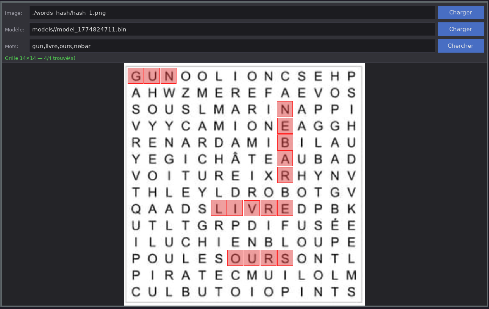

# OCR & Résolveur de mots mêlés

OCR complet en C (C99) avec SDL2 et libpng, capable de lire les lettres
d'une grille de mots mêlés et d'y rechercher des mots — avec une interface
graphique qui affiche les résultats directement sur l'image.



> **Documentation Doxygen complète :** [gobofo.github.io/OCR-project](https://gobofo.github.io/OCR-project/)

---

## Pipeline

```
Image PNG
  └─► Prétraitement     grayscale → binarisation → (rotation optionnelle)
        └─► Segmentation    détection des cellules de la grille
              └─► CNN         reconnaissance de chaque lettre (A–Z)
                    └─► Résolveur   recherche de mots en 8 directions
```

---

## Dépendances

| Bibliothèque | Rôle |
|---|---|
| **libpng** | Chargement et sauvegarde des images PNG |
| **SDL2** | Rendu (rotation d'image, GUI) |
| **SDL2_ttf** | Texte dans l'interface graphique |
| **libm** | Fonctions mathématiques (sqrt, cos, …) |
| **libpthread** | Parallélisme lors du chargement du dataset |

Installation sur Arch Linux :
```bash
sudo pacman -S sdl2 sdl2_ttf libpng ttf-dejavu
```

Installation sur Debian/Ubuntu :
```bash
sudo apt install libsdl2-dev libsdl2-ttf-dev libpng-dev fonts-dejavu
```

---

## Compilation

```bash
make all      # compile ./train, ./solve et ./gui  (cible par défaut)
make train    # compile uniquement ./train
make solve    # compile uniquement ./solve
make gui      # compile uniquement ./gui  (requiert SDL2_ttf)
make clean    # supprime les .o et les binaires
```

Option debug :
```bash
make DEBUG=1
```

---

## Utilisation

### Entraînement

```bash
./train --data training_data/ --output models/mon_modele.bin -j4
```

| Option | Défaut | Description |
|---|---|---|
| `--data <dossier>` | `training_data/` | Racine du dataset (sous-dossiers A–Z) |
| `--output <fichier>` | `models/model_<ts>.bin` | Fichier de sortie du modèle |
| `-j<N>` | `1` | Nombre de threads de chargement |

Structure attendue du dataset :
```
training_data/
  A/  img1.png  img2.png  …
  B/  …
  …
  Z/  …
```

### Résolution (ligne de commande)

```bash
./solve --image grille.png --model models/mon_modele.bin --words CHAT,CHIEN -v
```

| Option | Défaut | Description |
|---|---|---|
| `--image <fichier>` | *(obligatoire)* | Image de la grille à analyser |
| `--model <fichier>` | dernier `.bin` dans `models/` | Modèle à utiliser |
| `--words <liste>` | *(aucune)* | Mots à rechercher, séparés par des virgules |
| `--verbose` / `-v` | désactivé | Affiche les détails de reconnaissance |

Si aucun `--model` n'est fourni et que le dossier `models/` est vide,
`./solve` affiche une erreur claire et quitte avec le code `2`.

### Interface graphique

```bash
./gui                          # détecte automatiquement le dernier modèle
./gui --model models/model.bin # spécifie un modèle
```


L'interface propose trois champs de saisie :

| Champ | Action |
|---|---|
| **Image** | Chemin vers l'image PNG de la grille |
| **Modèle** | Chemin vers le fichier `.bin` (pré-rempli avec le dernier modèle) |
| **Mots** | Liste de mots séparés par des virgules |

- Cliquer sur un champ ou utiliser **Tab** pour naviguer entre eux
- **Entrée** pour valider / lancer la recherche
- **Ctrl+V** pour coller un chemin depuis le presse-papiers
- **Ctrl+Q** pour quitter
- Les mots trouvés sont entourés en rouge directement sur l'image affichée ; l'image originale n'est jamais modifiée en mémoire.

---

## Architecture CNN

```
Entrée 56×56 (float, 0–1)
  Conv2D  16 filtres 3×3        →  16×54×54
  ReLU
  MaxPool 4×4                   →  16×13×13
  Flatten                       →  2704
  Dense   2704 → 128
  ReLU
  Dense    128 →  26
  Softmax                       →  P(A) … P(Z)
```

Entraînement : initialisation He, SGD + momentum (lr = 0,001 ; β = 0,9),
perte cross-entropie, taille de batch 32.

---

## Structure du projet

```
.
├── Makefile
├── train_main.c            Point d'entrée de ./train
├── solve_main.c            Point d'entrée de ./solve
├── gui_main.c              Point d'entrée de ./gui (interface graphique)
├── src/
│   ├── cnn/
│   │   ├── cnn.h / cnn.c          Architecture CNN, passe avant/arrière
│   │   ├── model.h / model.c      Sérialisation binaire du modèle
│   │   └── dataset.h / dataset.c  Chargement du dataset (POSIX threads)
│   ├── preprocess/
│   │   └── image.h / image.c      Chargement libpng, grayscale, binarisation, resize
│   ├── segment/
│   │   └── segment.h / segment.c  Composantes connexes, détection de grille
│   └── solver/
│       └── solver.h / solver.c    Recherche en 8 directions
├── models/                 Modèles entraînés (.bin)
├── screenshoot/            Captures d'écran
└── training_data/          Dataset d'entraînement (A–Z)
```

## Format du fichier modèle

```
[magic 4 octets : 'OCRC'] [version uint32] [CNNWeights : ~1,4 Mo]
```

Le fichier est un dump binaire plat de la structure `CNNWeights`.
Version actuelle : **1**.

---

## Codes de retour

| Binaire | Code | Signification |
|---|---|---|
| `train` | `0` | Succès |
| `train` | `1` | Erreur d'argument |
| `train` | `2` | Erreur de chargement du dataset |
| `train` | `3` | Erreur de sauvegarde du modèle |
| `solve` | `0` | Succès |
| `solve` | `1` | Erreur d'argument |
| `solve` | `2` | Modèle introuvable ou invalide |
| `solve` | `3` | Erreur de chargement de l'image |
| `solve` | `4` | Erreur de segmentation |
| `gui` | `0` | Succès |
| `gui` | `1` | Erreur SDL2 / TTF |
